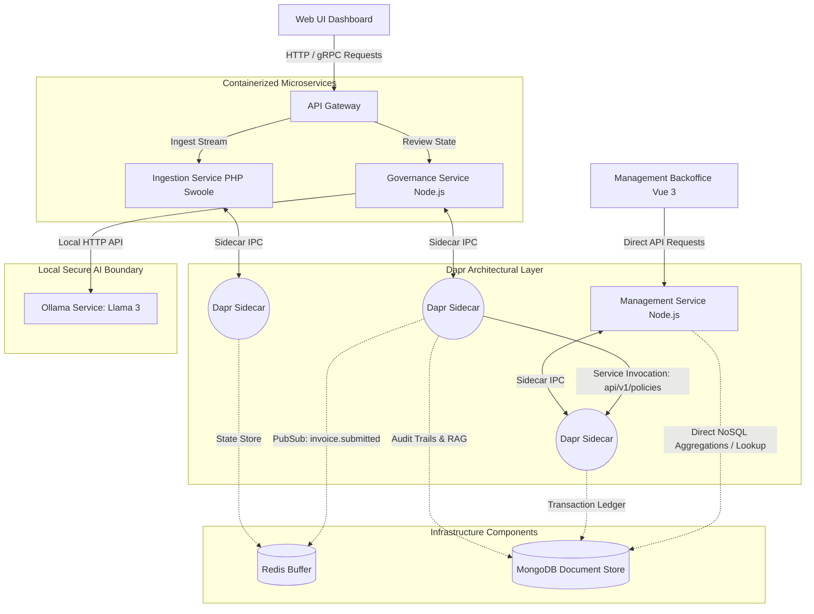
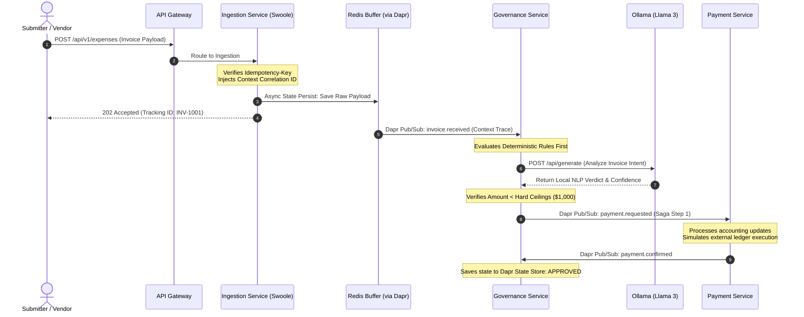
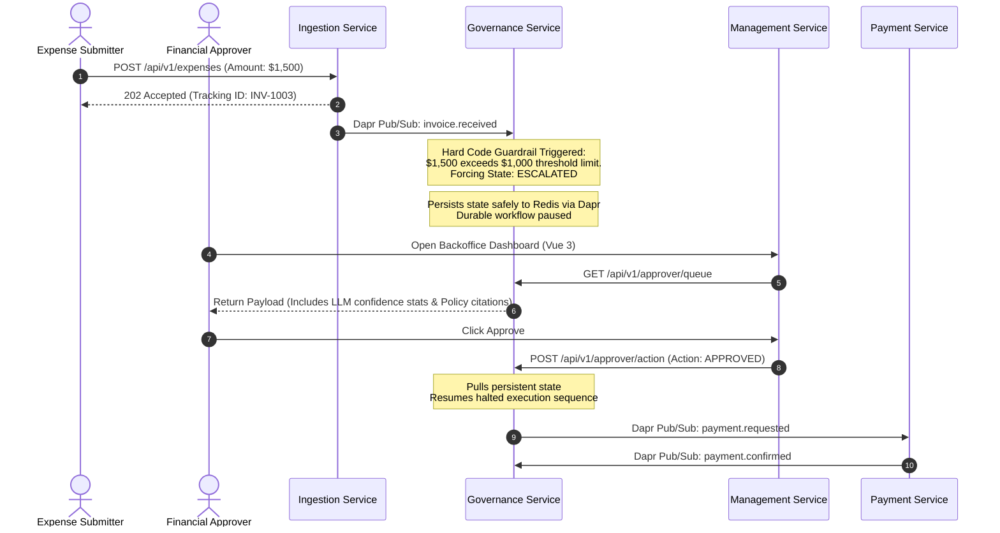
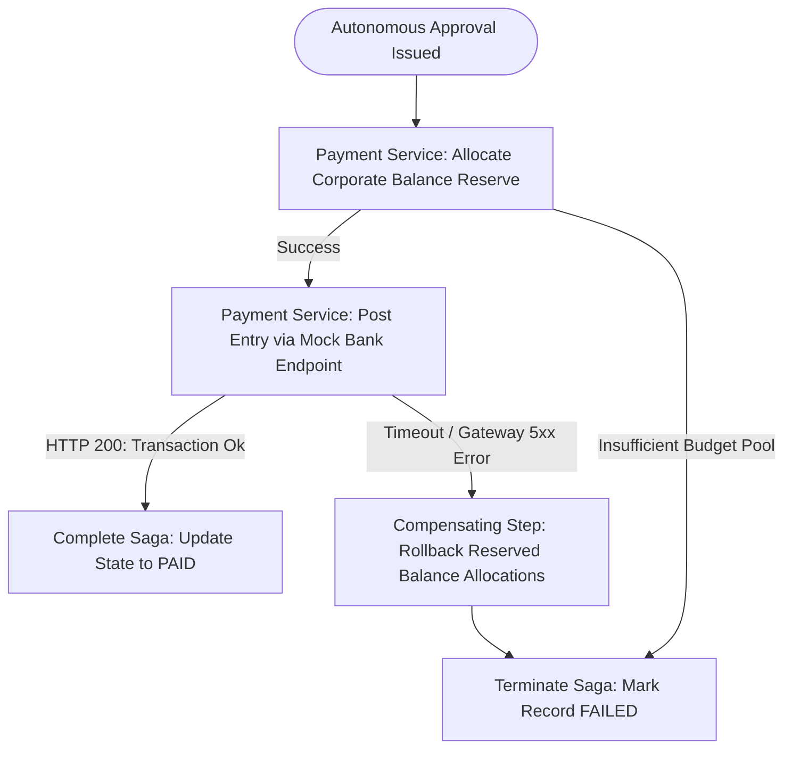

# ApprovalFlow — Microservice Architecture & Design Specifications

This document outlines the distributed microservice topology, transaction flows, and AI integration principles governing the ApprovalFlow expense management system.

## 1. Architectural Strategy & Autonomy Dilemma

ApprovalFlow is designed to automatically process high-volume, repetitive corporate expenses while enforcing rigid, deterministic fiscal guardrails.

### The Autonomy Posture
To protect enterprise funds from potential LLM hallucinations, prompt injections, or logic bypasses, the system separates **AI Evaluation** from **Execution Authorization**.

* **The Absolute Cap:** Programmatically configured at **\$1,000**. No invoice equal to or greater than \$1,000 will ever be auto-approved, regardless of the AI Agent's evaluation score or confidence level.
* **Deterministic Rules:** Specific categories such as `Hardware`, `International Travel`, or `Entertainment` always trigger an automatic escalation state (`ESCALATED`), enforcing a human-in-the-loop validation flow.
* **Autonomous Range:** Items under **\$1,000** belonging to low-risk operational categories (`Software SaaS`, `Office Supplies`) are autonomously verified against corporate policy using an AI processing engine.

---

## 2. Component Design & System Boundary Topology

The system uses containerized microservices communicating via the **Dapr (Distributed Application Runtime)** sidecar pattern to abstract state storage, internal message routing, and secret protection mechanisms. For complex statistical analysis and data backoffice management, the Management Service connects directly to the core database.



### Microservice Directory
1. **Ingestion Service (PHP Swoole):** Exposes a high-performance, non-blocking input boundary using an event-driven event loop. It validates data structures, processes incoming headers for double-submission keys, and publishes raw events instantly to the Redis buffer via Dapr.
2. **Governance & AI Service (Node.js + Ollama):** Houses the AI orchestration agents, executes local rule verification algorithms, structures and updates the Human-in-the-Loop review queues, and stores persistent lifecycle logs. It interacts with the local Ollama instance for offline LLM evaluation.
3. **Management Service (Node.js & Vue 3):** Administrative backoffice. The Node.js backend bypasses Dapr abstractions to run complex analytical NoSQL aggregations, pipeline metrics, and policy configurations directly against MongoDB. The Vue 3 frontend renders the manager's operational dashboards
4. **Payment Service:** Controls corporate asset movement. It tracks ledger allocations, communicates with mock banking networks, and operates distributed consensus states.

---

## 3. End-to-End Operational Lifecycle Flows

### Scenario A: Fully Autonomous Path (Journey INV-1001)
*Condition: Standard SaaS bill, total value under threshold limits, strict adherence to all valid compliance lines.*



### Scenario B: Human-in-the-Loop Interception (Journey INV-1003)
*Condition: Large corporate capital purchase, total cost exceeds automated dollar threshold bounds (\$1,500).*



---

## 4. Transaction Consistency Protocol: The Payment Saga

To guarantee structural ledger alignment without locking underlying distributed databases, the platform relies on a **Choreographed Saga Pattern** utilizing event-driven microservices.



### Rollback Process Mechanics (Journey INV-1012)
1. **Initial Reserve:** `Payment Service` locks internal funds matching the invoice value to prevent over-allocation.
2. **External Link Failure:** The simulated banking node throws a network connection timeout.
3. **Trigger Compensation:** The service catches the exception, fires an internal rollback method to release the locked budget reserve, and publishes a `payment.failed` event message.
4. **Final Sync:** `Governance Service` captures the error message and shifts the final entity resolution state to `Rejected: Network Processing Error`.

---

## 5. Defensive Coding & Idempotency Safeguards

### Inbound De-duplication (Journey INV-1007)
* Client entities attach an explicit hash header string: `X-Idempotency-Key`.
* This fingerprint key combines specific data primitives: `Vendor ID`, `Invoice reference sequence number`, and `Exact Transaction Cost`.
* `Ingestion Service` performs an immediate check against the Dapr State Store with a configured 24-hour Time-to-Live (TTL) cache window.
* If a duplicate collision occurs, processing terminates instantly, returning the historical tracking record payload without initiating downline services.

### Hard Architectural Security Boundary
The code ensures safety checks are evaluated completely separate from LLM execution logic, removing any dependency on the model's textual responses:

```js
// Section 5: Hard Architectural Security Boundary (Node.js Implementation)
// Pure JavaScript deterministic guardrail enforced inside governance-service

let finalStatus = aiResult.recommendation;

// M12: Rigid programmatic verification protecting infrastructure execution boundaries
if (amount > 250.0 && finalStatus === "AUTO_APPROVE") {
    finalStatus = "HUMAN_REVIEW";
    aiResult.reason = `Deterministic router override: Amount $${amount} exceeds max agent autonomy threshold ($250).`;
}
```
