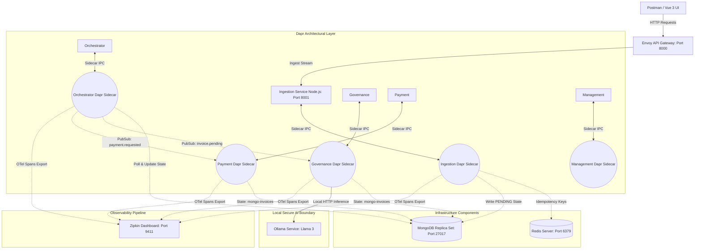
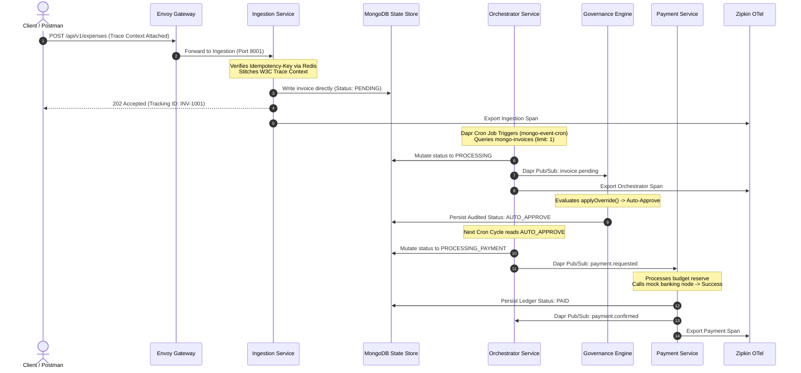
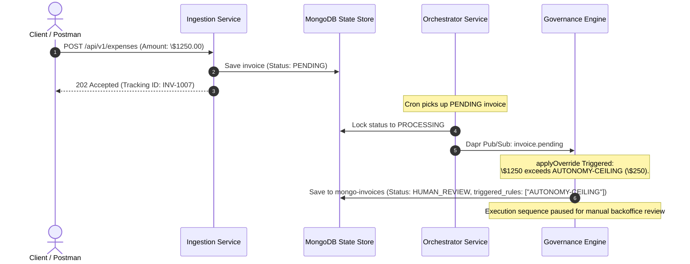
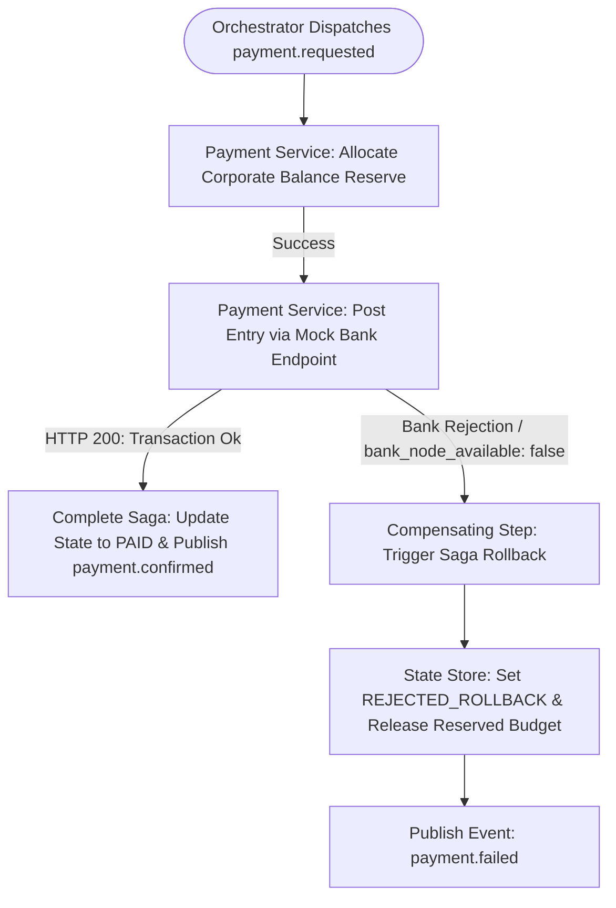

# ApprovalFlow — Microservice Architecture & Design Specifications

This document outlines the distributed microservice topology, transaction flows, and AI integration principles governing the ApprovalFlow expense management system.

## 1. Architectural Strategy & Autonomy Dilemma

ApprovalFlow is designed to automatically process high-volume, repetitive corporate expenses while enforcing rigid, deterministic fiscal guardrails.

### The Autonomy Posture
To protect enterprise funds from potential LLM hallucinations, prompt injections, or logic bypasses, the system separates **AI Evaluation** from **Execution Authorization**.

*   **The Absolute Cap:** Programmatically configured and enforced via runtime MongoDB policy injection at **$250.00**. No invoice exceeding $250.00 will ever be auto-approved, regardless of the AI Agent's evaluation score or confidence level; it is strictly escalated to human review.
*   **Deterministic Hard Stops:** Specific validation rules (such as missing receipts or unknown fraudulent vendors) trigger an immediate programmatic override status (`GLOBAL-RECEIPT` or `GLOBAL-FX`), short-circuiting the AI path entirely.
*   **Autonomous Range:** Items under **$250.00** satisfying the minimum baseline confidence configuration threshold (`AUTONOMY-CONFIDENCE = 0.80`) are autonomously verified against corporate policy using an AI processing engine.

---

## 2. Component Design & System Boundary Topology

The system uses containerized microservices communicating via the **Dapr (Distributed Application Runtime)** sidecar pattern to abstract state storage, internal message routing, and secret protection mechanisms. Distributed tracing spans are natively collected by Dapr and exported to an OpenTelemetry-compliant Zipkin backend.

### Microservice Directory
1.  **Ingestion Service (Node.js Express):** Exposes a high-performance input boundary. It validates JSON schemas, processes incoming headers for MD5-hashed idempotency keys in Redis to short-circuit duplicates, and writes new invoices directly with status PENDING into mongo-invoices.
2.  **Orchestrator Service (Node.js)** Centralized state-driven polling orchestrator (0010-orchestrator.md). Uses Dapr Scheduler (mongo-event-cron) to poll mongo-invoices item-by-item, locks records in PROCESSING state, and dispatches tasks to governance-service (invoice.pending) or payment-service (payment.requested).
2.  **Governance & AI Engine Agent (Node.js):** Listens to invoice.pending events. Evaluates deterministic hard stop constraints (currency checks, receipt requirements) and coordinates local asynchronous LLM inference cycles via Ollama. Updates evaluation results (AUTO_APPROVE, APPROVED, REJECTED) back into mongo-invoices.
3.  **Payment Service:** Controls corporate asset movement. Listens to payment.requested events, tracks budget allocations, simulates edge-case connectivity status triggers with mock banking endpoints, and publishes terminal events (payment.confirmed / payment.failed).
4.  **Management Service (Node.js + Vue 3):** Administrative backoffice backplane used to re-configure runtime autonomy ceiling properties dynamically inside MongoDB.

---

## 3. End-to-End Operational Lifecycle Flows

### Scenario A: Fully Autonomous Path (Journey INV-1001)
*Condition: Standard compliance invoice, total value under threshold bounds ($45.00), strict adherence to all valid compliance lines.*

### Scenario B: Human-in-the-Loop Interception (Journey INV-1007)
*Condition: High-value invoice ($1250.00), total cost breaches the automated dollar threshold rule ($250.00).*

---

## 4. Transaction Consistency Protocol: The Payment Saga

To guarantee structural ledger alignment without locking underlying distributed databases, the platform relies on an Orchestrated Saga Pattern utilizing event-driven microservices (0008-payment-saga.md).

### Rollback Process Mechanics (Journey INV-1012)
1.  **Initial Reserve:** `Payment Service` locks internal funds matching the invoice value to prevent over-allocation.
2.  **External Link Failure:** The simulated banking node throws a network connection timeout or a simulated rejection (`bank_node_available: false`).
3.  **Trigger Compensation:** The service catches the exception, updates the transaction state model to `REJECTED_ROLLBACK`, releases the locked budget reserve, and publishes `payment.failed`.
4.  **Final Sync:** `Orchestrator Service` and `Management Service` catch the failure event to notify audit logs and administration backoffice panels.

---

## 5. Defensive Coding & Idempotency Safeguards

### Inbound De-duplication (Journey INV-1003)
Every submission payload is hashed using an MD5 encryption sequence based on vendor, `invoiceNumber`, and `total` parameters. If a subsequent request matches an active concurrency transaction key inside Redis, the Ingestion layer short-circuits execution completely, returning the original `200 OK PROCESSING` schema state without generating duplicate database records or triggering downstream orchestrator cycles.
