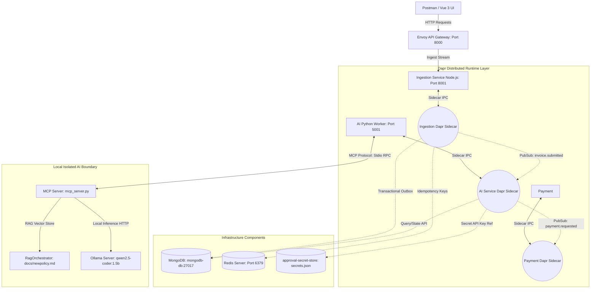
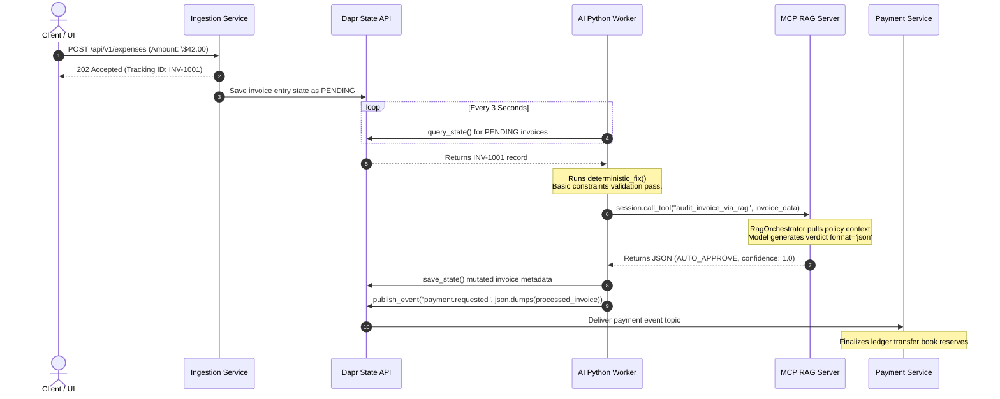
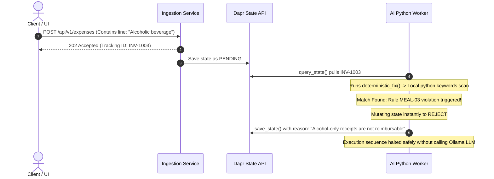
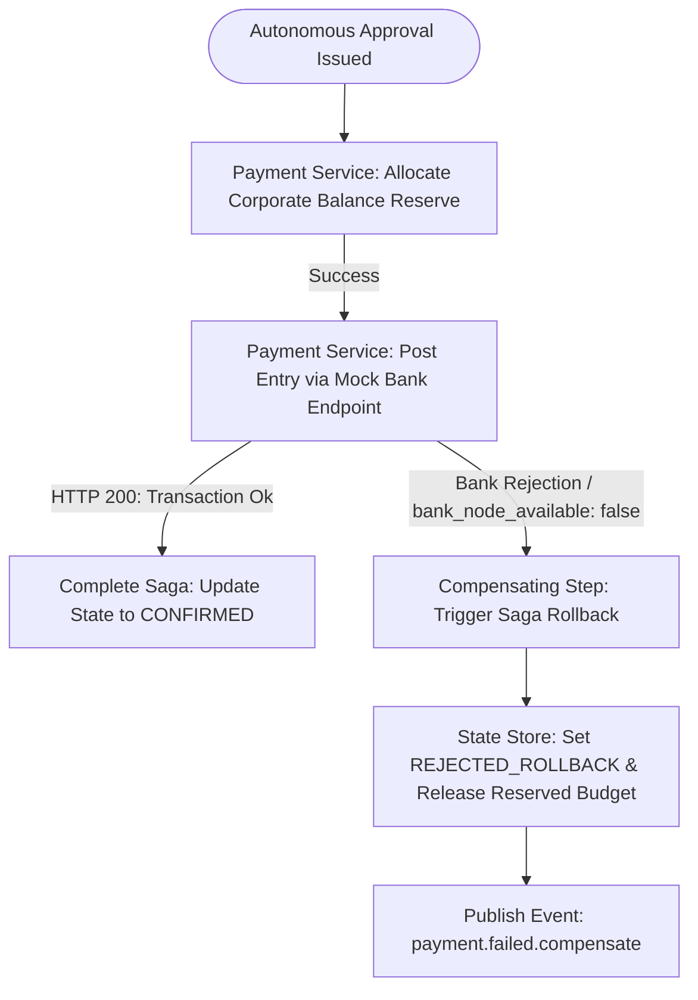

# ApprovalFlow — Microservice Architecture & Design Specifications

This document outlines the distributed microservice topology, transaction flows, and AI integration principles governing the ApprovalFlow expense management system.

## 1. Architectural Strategy & Autonomy Dilemma

ApprovalFlow is designed to automatically process high-volume, repetitive corporate expenses while enforcing rigid, deterministic fiscal guardrails.

### The Autonomy Posture
To protect enterprise funds from potential LLM hallucinations, prompt injections, or logic bypasses, the system separates **AI Evaluation** from **Execution Authorization** by combining a Python-native deterministic filter with an isolated MCP (Model Context Protocol) RAG Server.

*   **Deterministic Hard Stops (Client Worker):** Python-native code inside the execution worker short-circuits evaluation instantly for fatal violations (e.g., matching the `MEAL-03` alcohol-only keywords constraint) or missing mandatory parameters (`receiptPresent == false`). It applies strict rules before any network hops.
*   **The Absolute Cap:** Programmatically configured ceiling limits (such as hardware purchases exceeding $1,000 or general invoices > $2,000) trigger an immediate programmatic status mutation to `HUMAN_REVIEW` with corresponding metadata.
*   **Autonomous Range via MCP RAG:** Items requiring deeper contextual auditing are routed strictly via the Model Context Protocol (MCP) using a standard JSON-RPC Stdio channel to a server encapsulating `RagOrchestrator`. This engine leverages `qwen2.5-coder:1.5b` and vector stores (`nomic-embed-text`) to issue compliant auditing verdicts.

---

## 2. Component Design & System Boundary Topology

The system uses containerized microservices communicating via the **Dapr (Distributed Application Runtime)** sidecar pattern to abstract state storage, internal message routing, and secret protection mechanisms.



### Microservice Directory
1.  **Ingestion Service (Node.js Express):** Exposes a high-performance input boundary. It validates JSON schemas, processes incoming headers for MD5-hashed idempotency keys to short-circuit duplicates.
2.  **AI Audit Service Worker (Python 3.12):** A continuous loop (`while True`) worker that polls `PENDING` states from MongoDB using the Dapr State Query API. It runs deterministic rule sets and delegates contextual policy validation to the MCP Boundary.
3.  **MCP RAG Server (Python FastMCP):** An isolated subprocess executing compliance evaluation. It dynamically vectorizes enterprise compliance markdown data (`newpolicy.md`) using `nomic-embed-text` and asks `qwen2.5-coder:1.5b` for deterministic, schema-validated JSON audits.
4.  **Payment Service:** Controls corporate asset movement, tracks budget allocations, and handles distributed consistency protocols.

---

## 3. End-to-End Operational Lifecycle Flows

### Scenario A: Fully Autonomous Path (Journey INV-1001)
*Condition: Standard compliant meal expense ($42.00), under the strict $75/attendee constraint, receipt present, known vendor.*



### Scenario B: Automated Hard Rejection Interception (Journey INV-1003)
*Condition: Invoice includes forbidden lines (such as alcohol-only items matching strict exclusion criteria).*



---

## 4. Transaction Consistency Protocol: The Payment Saga

To guarantee structural ledger alignment without locking underlying distributed databases, the platform relies on a **Choreographed Saga Pattern** utilizing event-driven microservices.



---

## 5. Defensive Coding & Secret Store Isolation

### Distributed Component Credentials
Database connection parameters are never hardcoded inside the service specifications. The `mongo-budgets` state store configuration maps secrets securely using Dapr abstraction primitives hooked up to an underlying isolated file backing.

```yaml
apiVersion: dapr.io/v1alpha1
kind: Component
metadata:
  name: mongo-budgets
spec:
  type: state.mongodb/v1
  version: v1
  metadata:
    - name: connectionString
      secretKeyRef:
        name: mongodb-connection-string
        key: mongodb-connection-string  
    - name: databaseName
      value: "approvalflow"
  auth:
    secretStore: approval-secret-store
```
The true URI value (`mongodb://mongodb-db:27017/approvalflow`) is injected into the engine runtime boundary by Dapr securely reading from the mounted `/dapr/secrets.json` location.
