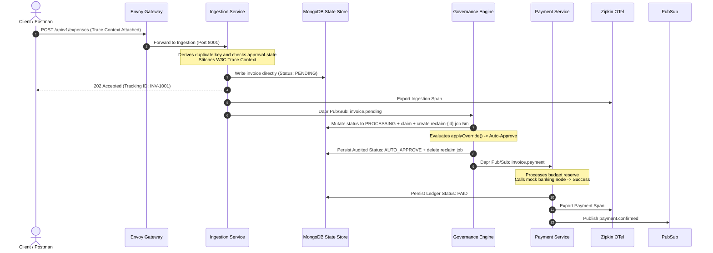
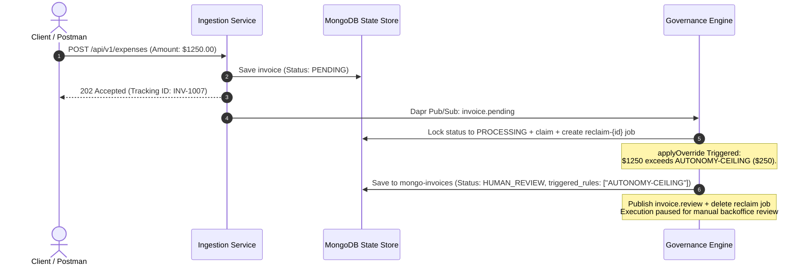
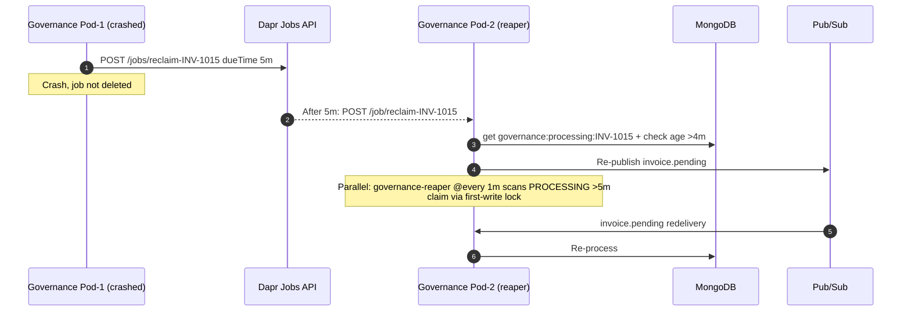
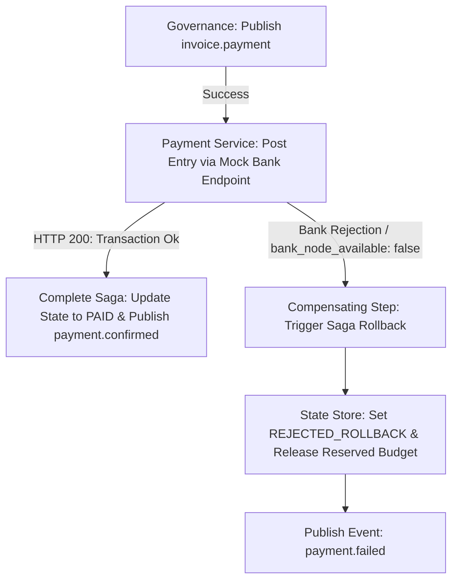

# ApprovalFlow — Microservice Architecture & Design Specifications

This document outlines the distributed microservice topology, transaction flows, and AI integration principles governing the ApprovalFlow expense management system.

## 1. Architectural Strategy & Autonomy Dilemma

ApprovalFlow is designed to automatically process high-volume, repetitive corporate expenses while enforcing rigid, deterministic fiscal guardrails.

### The Autonomy Posture
To protect enterprise funds from potential LLM hallucinations, prompt injections, or logic bypasses, the system separates **AI Evaluation** from **Execution Authorization**.

*   **The Absolute Cap:** Programmatically configured and enforced via runtime MongoDB policy injection at **$250.00**. No invoice exceeding $250.00 will ever be auto-approved, regardless of the AI Agent's evaluation score or confidence level; it is strictly escalated to human review.
*   **Deterministic Hard Stops:** Specific validation rules (such as missing receipts or unknown fraudulent vendors) trigger an immediate programmatic override status (`GLOBAL-RECEIPT` or `GLOBAL-FX`), short-circuiting the AI path entirely.
*   **Autonomous Range:** Items under **$250.00** satisfying the minimum baseline confidence configuration threshold (`AUTONOMY-CONFIDENCE = 0.80`) are autonomously verified against corporate policy using an AI processing engine.

---

## 2. Component Design & System Boundary Topology

The system uses containerized microservices communicating via the **Dapr (Distributed Application Runtime)** sidecar pattern to abstract state storage, internal message routing, secret protection, and **Jobs API** (`v1.0-alpha1/jobs`). Distributed tracing spans are natively collected by Dapr and exported to an OpenTelemetry-compliant Zipkin backend.

```mermaid
graph TD
    Client[Postman / Vue 3 UI] -->|HTTP Requests| Envoy[Envoy API Gateway: Port 8000]
    Envoy -->|Ingest Stream| Ingestion[Ingestion Service TypeScript / Node.js: Port 8001]

    subgraph Microservices Layer
        Ingestion        
        Governance[Governance Service TypeScript / Node.js: Port 8002]
        Payment[Payment Service TypeScript / Node.js: Port 8003]
        Management[Management Service TypeScript + Vue 3: Port 8004]
    end

    subgraph Dapr Sidecar Layer
        Ingestion <-->|Sidecar IPC| Dapr1((Ingestion Dapr Sidecar))
        Governance <-->|Sidecar IPC| Dapr2((Governance Dapr Sidecar))
        Payment <-->|Sidecar IPC| Dapr3((Payment Dapr Sidecar))
        Management <-->|Sidecar IPC| Dapr4((Management Dapr Sidecar))
    end

    subgraph Infrastructure Components
        Dapr1 -.->|Idempotency Keys| Redis[(Redis Server: Port 6379)]
        
        %% Database Connections
        Dapr1 -.->|Write PENDING State| DB[(MongoDB Replica Set: Port 27017)]
        Dapr2 -.->|Update Audit State| DB
        Dapr3 -.->|Update Ledger State| DB

        %% Dapr Pub/Sub Broker abstraction
        Dapr1 -.->|Publish: invoice.pending| PubSub{Dapr Pub/Sub Broker}
        Dapr2 -.->|Publish: invoice.payment, invoice.review, invoice.processed| PubSub
        Dapr3 -.->|Publish: payment.confirmed, payment.failed| PubSub
        PubSub -.->|Deliver: invoice.pending| Dapr2
        PubSub -.->|Deliver: invoice.payment| Dapr3

        %% Dapr Jobs API
        Dapr2 -.->|Create: reclaim-{id} 5m + governance-reaper @every 1m| JobsAPI[Dapr Jobs API]
        JobsAPI -.->|Trigger: /job/{name}| Dapr2
    end

    subgraph Local Secure AI Boundary
        Governance -->|Local HTTP Inference| Ollama[Ollama Service: Llama 3 / Qwen 2.5]
    end

    subgraph Observability Pipeline
        Dapr1 -.->|OTel Spans| Zipkin[Zipkin Dashboard: Port 9411]
        Dapr2 -.->|OTel Spans| Zipkin
        Dapr3 -.->|OTel Spans| Zipkin
        Dapr4 -.->|OTel Spans| Zipkin
    end
```

### Microservice Directory
1.  **Ingestion Service (TypeScript / Node.js Express):** Exposes a high-performance input boundary. It validates the request, derives an MD5 idempotency key from `vendor`, `invoiceNumber`, and `total`, stores the invoice in `mongo-invoices`, records the duplicate guard in `approval-state` (Redis via Dapr State), and publishes `invoice.pending`.
2.  **Governance & AI Engine Agent (TypeScript / Node.js + Express + Dapr Jobs):** Consumes `invoice.pending` via Dapr Pub/Sub consumer groups, evaluates deterministic hard-stop constraints and local Ollama inference, updates `mongo-invoices`, and publishes final decision topics.
    - **Topics Produced:** `invoice.processed` (intermediate), `invoice.payment` (auto-approve path), `invoice.review` (human escalation).
    - **Stuck Processing Recovery (2-level, Dapr Jobs API v1.0-alpha1):**
      - **L1 - Per-Invoice Reclaim Job:** On transition to `PROCESSING`, creates transient job `reclaim-{tracking_id}` with `dueTime: 5m` via `POST /v1.0-alpha1/jobs/{name}` with protobuf Any payload (`tracking_id`). On HTTP trigger `POST /job/reclaim-{id}`, `handleReclaimJob()` checks Dapr State `governance:processing:{id}` and MongoDB `PROCESSING` age. If `age > 4m`, re-publishes `invoice.pending`. Job deleted in `finally` block of `processInvoice()` via `DELETE /v1.0-alpha1/jobs/{name}`.
      - **L2 - Global Reaper Job:** Recurring job `governance-reaper` scheduled with `schedule: @every 1m`, `repeats: 0`. `handleReaperJob()` scans `PROCESSING` invoices (limit 100), filters `now - updated_at > 5m`. Uses Dapr State optimistic concurrency (`concurrency: first-write` + `ttlInSeconds: 3600` + `owner: HOSTNAME`) as distributed lock `governance:processing:{tracking_id}` to ensure only one replica re-queues. Publishes `invoice.pending` and releases claim.
    - **Concurrency Control:** In-memory queue `enqueueInvoice()` + `queuedInvoiceIds` Set + `claimInvoice()` / `releaseInvoiceClaim()` prevents duplicate processing within pod and across pods.
3.  **Payment Service (TypeScript / Node.js):** Consumes `invoice.payment`, tracks department budgets and FX conversion via `getFxRate()`, simulates bank failures, updates the invoice ledger state, and publishes `payment.confirmed` or `payment.failed`.
4.  **Management Service (TypeScript + Vue 3):** Provides the administrative backoffice, dynamic policy and financial configuration (runtime MongoDB policy injection), invoice review actions, and event-driven UI notifications.

---

## 3. End-to-End Operational Lifecycle Flows

### Scenario A: Fully Autonomous Path (Journey INV-1001)
*Condition: Standard compliance invoice, total value under threshold bounds ($45.00), strict adherence to all valid compliance lines.*

```mermaid
sequenceDiagram
    autonumber
    actor Client as Client / Postman
    participant Envoy as Envoy Gateway
    participant IS as Ingestion Service
    participant DB as MongoDB State Store
    participant GS as Governance Engine
    participant PS as Payment Service
    participant ZK as Zipkin OTel

    Client->>Envoy: POST /api/v1/expenses (Trace Context Attached)
    Envoy->>IS: Forward to Ingestion (Port 8001)
    Note over IS: Derives duplicate key and checks approval-state<br/>Stitches W3C Trace Context
    IS->>DB: Write invoice directly (Status: PENDING)
    IS-->>Client: 202 Accepted (Tracking ID: INV-1001)
    IS->>ZK: Export Ingestion Span

    IS->>GS: Dapr Pub/Sub: invoice.pending
    GS->>DB: Mutate status to PROCESSING + claim + create reclaim-{id} job 5m

    Note over GS: Evaluates applyOverride() -> Auto-Approve
    GS->>DB: Persist Audited Status: AUTO_APPROVE + delete reclaim job

    GS->>PS: Dapr Pub/Sub: invoice.payment

    Note over PS: Processes budget reserve<br/>Calls mock banking node -> Success
    PS->>DB: Persist Ledger Status: PAID
    PS->>ZK: Export Payment Span
    PS->>PubSub: Publish payment.confirmed
```

### Scenario B: Human-in-the-Loop Interception (Journey INV-1007)
*Condition: High-value invoice ($1250.00), total cost breaches the automated dollar threshold rule ($250.00).*

```mermaid
sequenceDiagram
    autonumber
    actor Client as Client / Postman
    participant IS as Ingestion Service
    participant DB as MongoDB State Store    
    participant GS as Governance Engine

    Client->>IS: POST /api/v1/expenses (Amount: $1250.00)
    IS->>DB: Save invoice (Status: PENDING)
    IS-->>Client: 202 Accepted (Tracking ID: INV-1007)
    
    IS->>GS: Dapr Pub/Sub: invoice.pending
    GS->>DB: Lock status to PROCESSING + claim + create reclaim-{id} job
    
    Note over GS: applyOverride Triggered:<br/>$1250 exceeds AUTONOMY-CEILING ($250).
    GS->>DB: Save to mongo-invoices (Status: HUMAN_REVIEW, triggered_rules: ["AUTONOMY-CEILING"])
    Note over GS: Publish invoice.review + delete reclaim job<br/>Execution paused for manual backoffice review
```

### Scenario C: Stuck Processing Reclaim (Journey INV-1015)
*Condition: Pod crashes during Ollama inference, invoice left in PROCESSING.*

```mermaid
sequenceDiagram
    autonumber
    participant GS1 as Governance Pod-1 (crashed)
    participant DAPR as Dapr Jobs API
    participant GS2 as Governance Pod-2 (reaper)
    participant DB as MongoDB
    participant PubSub as Pub/Sub

    GS1->>DAPR: POST /jobs/reclaim-INV-1015 dueTime 5m
    Note over GS1: Crash, job not deleted
    DAPR-->>GS2: After 5m: POST /job/reclaim-INV-1015
    GS2->>DB: get governance:processing:INV-1015 + check age >4m
    GS2->>PubSub: Re-publish invoice.pending
    Note over GS2: Parallel: governance-reaper @every 1m scans PROCESSING >5m<br/>claim via first-write lock

    PubSub->>GS2: invoice.pending redelivery
    GS2->>DB: Re-process
```

---

## 4. Transaction Consistency Protocol: The Payment Saga

To guarantee structural ledger alignment without locking underlying distributed databases, the platform relies on a choreographed Saga Pattern using event-driven microservices (0008-payment-saga.md).

```mermaid
graph TD    
    Step1[Governance: Publish invoice.payment] -->|Success| Step2[Payment Service: Post Entry via Mock Bank Endpoint]
    Step2 -->|HTTP 200: Transaction Ok| Commit[Complete Saga: Update State to PAID & Publish payment.confirmed]
    
    %% Failure Exception Pathways
    Step2 -->|Bank Rejection / bank_node_available: false| Comp1[Compensating Step: Trigger Saga Rollback]
    Comp1 --> Reset[State Store: Set REJECTED_ROLLBACK & Release Reserved Budget]
    Reset --> Emit[Publish Event: payment.failed]
```

### Rollback Process Mechanics (Journey INV-1012)
1.  **Initial Reserve:** `Payment Service` locks internal funds matching the invoice value to prevent over-allocation.
2.  **External Link Failure:** The simulated banking node throws a network connection timeout or a simulated rejection (`bank_node_available: false`).
3.  **Trigger Compensation:** The service catches the exception, updates the transaction state model to `REJECTED_ROLLBACK`, releases the locked budget reserve, and publishes `payment.failed`.

---

## 5. Defensive Coding & Idempotency Safeguards

### Inbound De-duplication (Journey INV-1003)
Every submission payload is hashed using an MD5 digest based on vendor, `invoiceNumber`, and `total` parameters. If a subsequent request matches an active key in the `approval-state` Dapr store, the Ingestion layer short-circuits execution and returns the original `200 OK PROCESSING` state without creating a duplicate invoice or publishing another `invoice.pending` event.

### Processing Idempotency (Governance)
*   **At-least-once Pub/Sub:** Dapr delivers `invoice.pending` at least once. Guarded by `governance:processing:{tracking_id}` with `first-write` concurrency and TTL 3600.
*   **In-Memory Deduplication:** `queuedInvoiceIds` Set prevents same pod from enqueuing duplicate `tracking_id`.
*   **MongoDB Unique Index:** Unique index on `invoices.tracking_id` prevents double insert on race.
*   **Job Idempotency:** `safeJobName()` sanitizes to `reclaim-{id}` <=80 chars `[^a-zA-Z0-9-_]` -> `-` to ensure deterministic job names.

### Canonical Types
*   Single source of truth: `services/governance/types/Invoice.ts` and `services/governance/types/Policy.ts` with `normalizeInvoice()` helper handling `string | number` total from Mongo.
*   Backward-compatible Policy fields: `id` / `rule_id` and `category` / `categories`.
